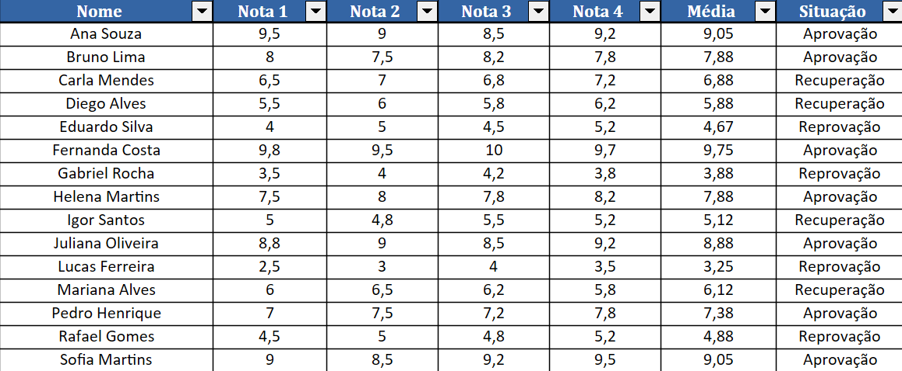
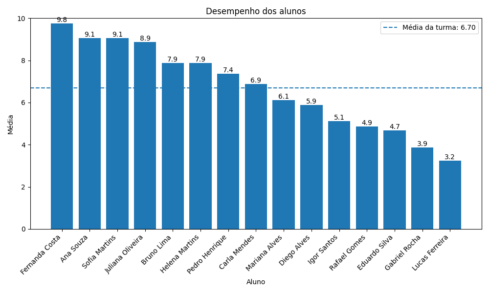
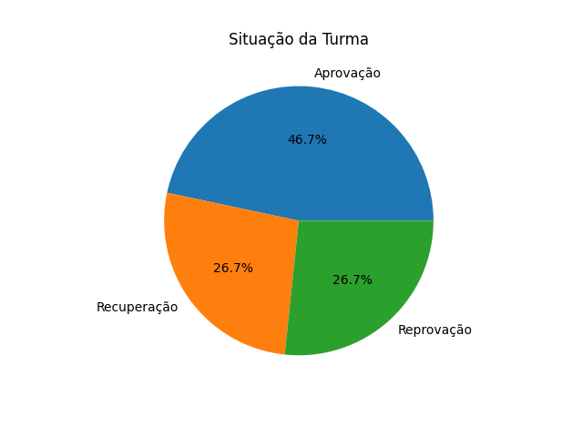

# Análise de Desempenho Acadêmico


---

## Sobre o Projeto

**Análise de Desempenho Acadêmico** é uma aplicação desenvolvida em Python para cadastrar alunos, registrar notas, calcular médias e classificar o desempenho acadêmico.

O sistema também realiza o cálculo de estatísticas da turma, cria um ranking de desempenho e gera automaticamente um relatório em Excel e gráficos para visualização dos resultados.

O projeto foi desenvolvido com finalidade educacional e de portfólio, visando praticar programação em Python, manipulação de arquivos, estatística básica e visualização de dados.

---

## Demonstração

### Relatório Excel



*Relatório gerado automaticamente contendo os dados dos alunos, médias, situações acadêmicas, estatísticas da turma e ranking de desempenho.*

---

### Médias dos Alunos



*Gráfico de barras comparando as médias dos alunos e apresentando a média geral da turma.*

---

### Situações Acadêmicas



*Gráfico de pizza apresentando a distribuição dos alunos entre aprovação, recuperação e reprovação.*

---

## Funcionalidades

- Cadastro de múltiplos alunos com quatro notas e validação dos valores entre 0 e 10.
- Cálculo das médias, classificação acadêmica e estatísticas gerais da turma.
- Geração automática de relatório Excel, ranking de desempenho e gráficos.

---

## Tecnologias e Ferramentas

- Python
- OpenPyXL
- Matplotlib

---

## Conceitos Aplicados

- Estruturas condicionais, repetição e funções.
- Listas, dicionários, ordenação e validação de dados.
- Manipulação de arquivos, estatística básica e visualização de dados.

---

## Estrutura do Projeto

```text
sistema-de-analise-de-desempenho-academico/
│
├── main.py
├── requirements.txt
├── .gitignore
├── README.md
│
├── relatorios/
│   └── relatorio-de-desempenhos.xlsx
│
├── graficos/
│   ├── grafico-medias-turma.png
│   └── grafico-situacoes-turma.png
│
├── imagens/
│   ├── grafico-medias-turma.png
│   ├── grafico-situacoes-turma.png
│   └── planilha-relatorio-de-desempenhos.png
│
└── documentacao/
    ├── descricao.md
    ├── estrutura.md
    └── funcionamento.md
```

---

## Como Executar

### 1. Clone o repositório

```bash
git clone https://github.com/Ana-BeatrizSilva/sistema-de-analise-de-desempenho-academico.git
```

### 2. Acesse a pasta do projeto

```bash
cd sistema-de-analise-de-desempenho-academico
```

### 3. Instale as dependências

```bash
pip install -r requirements.txt
```

### 4. Execute o projeto

```bash
python main.py
```

---

## Possíveis Melhorias Futuras

- Exportação dos dados para outros formatos, como CSV ou PDF.
- Integração com banco de dados para armazenamento dos alunos.
- Desenvolvimento de uma interface gráfica para utilização do sistema.
